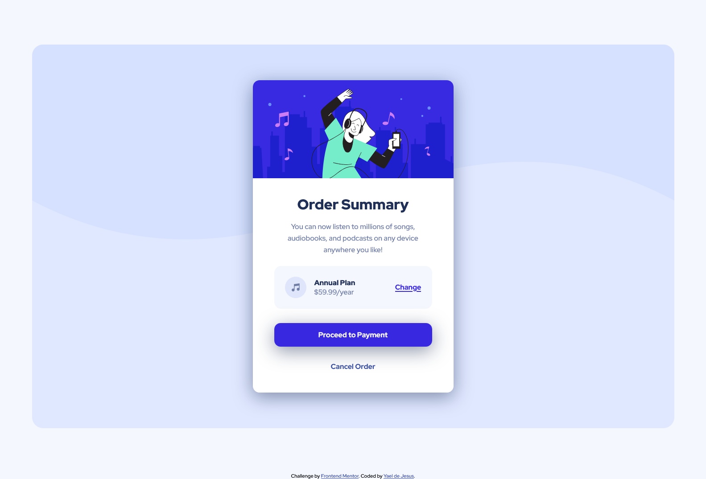

# Frontend Mentor - Order summary card solution

This is a solution to the [Order summary card challenge on Frontend Mentor](https://www.frontendmentor.io/challenges/order-summary-component-QlPmajDUj). Frontend Mentor challenges help you improve your coding skills by building realistic projects. 

## Table of contents

- [Overview](#overview)
  - [Screenshot](#screenshot)
  - [Links](#links)
- [My process](#my-process)
  - [Built with](#built-with)
  - [Continued development](#continued-development)
- [Author](#author)

## Overview

  This is the solution of my first Frontend challege, specifically for the Order Sumary card component 
### Screenshot

### Links

- Solution URL:(https://yael1987.github.io/Order-Sumary-challenge/)

## My process

  I try to use just CSS and HTML but for the positioning I used Flexbox, also I used responsive units like rem to make the mobile version

### Built with

- Semantic HTML5 markup
- Flexbox
- Responsive units

### Continued development

  I'll continue devaloping and trying to be faster by coding cause this took me a little of time to do it. Note: Forgive my bad English, I haven't practiced much:( 

## Author

- Frontend Mentor - [@yourusername](https://www.frontendmentor.io/profile/yourusername)
